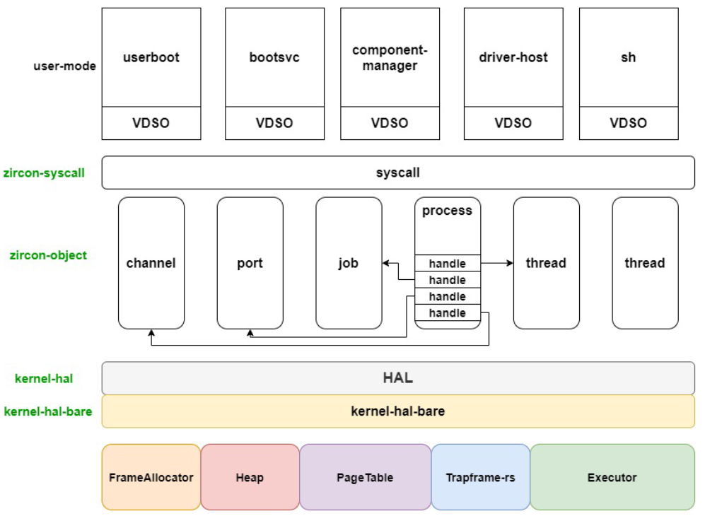

# zCore 整体结构和设计模式

首先，从 [Rust语言操作系统的设计与实现,王润基本科毕设论文,2019](https://github.com/rcore-os/zCore/wiki/files/wrj-thesis.pdf) 和 [zCore操作系统内核的设计与实现,潘庆霖本科毕设论文,2020](https://github.com/rcore-os/zCore/wiki/files/pql-thesis.pdf) 可以了解到从 rCore 的设计到 zCore 的设计过程的全貌。

## zCore 的整体结构

[zCore](https://github.com/rcore-os/zCore) 的整体结构/项目设计图如下：

zCore的设计主要有两个出发点：

- 内核对象的封装：将内核对象代码封装为一个库，保证可重用
- 硬件接口的设计：使硬件与内核对象的设计相对独立，只向上提供统一、抽象的API接口

项目设计从上到下，上层更远离硬件，下层更接近硬件。

zCore 设计的顶层是上层操作系统，比如 zCore、rCore、Zircon LibOS 和 Linux LibOS。在项目架构中，各版本的操作系统有部分公用代码。与 zCore 微内核设计实现相关的部分则主要是图中左侧蓝色线部分。

第二层，是 ELF 程序加载层（ELF Program Loader），包括 zircon-loader 和 linux-loader，其中封装了初始化内核对象、部分硬件相关的初始化、设定系统调用接口、运行首个用户态程序等逻辑，并形成一个库函数。zCore 在顶层通过调用 zircon-loader 库中的初始化逻辑，进入第一个用户态程序执行。

第三层，是系统调用实现层（Syscall Implementation），包括 zircon-syscall 和 linux-syscall，这一层将所有的系统调用处理例程封装为一个系统调用库，供上方操作系统使用。

第四层，利用硬件抽象层提供的虚拟硬件 API 进行内核对象（Kernel Objects）的实现，并且基于实现的各类内核对象，实现第三层各个系统调用接口所需要的具体处理例程。

第五层，是硬件抽象层（HAL，Hardware Abstraction Layer），这里对应的是 kernel-hal 模块。kernel-hal 将向上提供所有操作硬件需要的接口，从而使得硬件环境对上层操作系统透明化。

第六层，是对直接操作硬件的代码进行一层封装，对应模块为 kernel-hal-bare 和 kernel-hal-unix。kernel-hal 系列库仅仅负责接口定义，即将底层硬件/宿主操作系统的操作翻译为上层操作系统可以使用的形式。在这里，kernel-hal-bare 负责翻译裸机的硬件功能，而 kernel-hal-unix 则负责翻译类 Unix 系统的系统调用。

最底层是底层运行环境，包括 Bare Metal（裸机），Linux / macOS 操作系统。Bare Metal可以认为是硬件架构上的寄存器等硬件接口。

## zCore 内核组件

zCore 内核运行时组件层次概况如下：

在zCore启动过程中，会初始化物理页帧分配器、堆分配器、线程调度器等各个组成部分。并委托 zircon-­loader 进行内核对象的初始化创建过程，然后进入用户态的启动过程开始执行。每当用户态触发系统调用进入内核态，系统调用处理例程将会通过已实现的内核对象的功能来对服务请求进行处理；而对应的内核对象的内部实现所需要的各种底层操作，则是通过 HAL 层接口由各个内核组件负责提供。

其中，VDSO（Virtual dynamic shared object）是一个映射到用户空间的 so 文件，可以在不陷入内核的情况下执行一些简单的系统调用。在设计中，所有中断都需要经过 VDSO 拦截进行处理，因此重写 VDSO 便可以实现自定义的对下层系统调用（syscall）的支持。Executor 是 zCore 中基于 Rust 的 `async` 机制的协程调度器。

在HAL接口层的设计上，还借助了 Rust 的能够指定函数链接过程的特性。即，在 kernel-­hal 中规定了所有可供 zircon­-object 库及 zircon-­syscall 库调用的虚拟硬件接口，以函数 API 的形式给出，但是内部均为未实现状态，并设置函数为弱引用链接状态。在 kernel­-hal-­bare 中才给出裸机环境下的硬件接口具体实现，编译 zCore 项目时、链接的过程中将会替换/覆盖 kernel-­hal 中未实现的同名接口，从而达到能够在编译时灵活选择 HAL 层的效果。